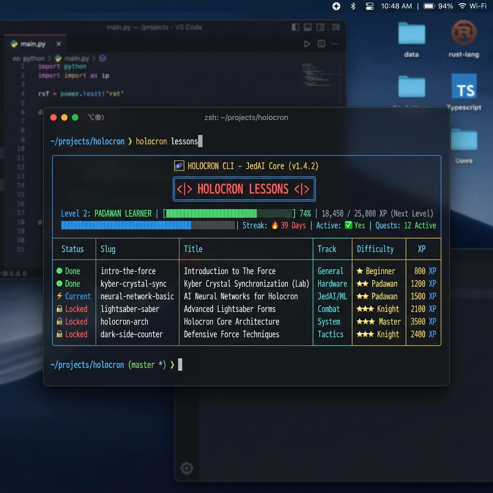

# Holocron

[](https://github.com/AshcrestHQ/Holocron/actions/workflows/ci.yml)
[](LICENSE)
[](https://www.python.org/downloads/)
[](https://ashcresthq-site.vercel.app)

> AshcrestHQ's learn-by-doing CLI — security fundamentals and open source contribution skills, one lesson at a time.

Holocron is an interactive, gamified command-line application built by AshcrestHQ. It guides developers through terminal-based lessons in cybersecurity fundamentals and open-source workflow practices (git branching, PR etiquette, and code reviews), awarding XP, tracking streaks, and preparing contributors to open real pull requests on projects like Janus and Aegis.

---

## Screenshot / Demo



---

## GitHub Topics

`cybersecurity` · `open-source` · `cli` · `python` · `typer` · `gamification` · `education` · `ashcrest-hq`

---

## Project Homepage

Visit the official AshcrestHQ portal and contribution guide:
- **Website**: [https://ashcresthq-site.vercel.app](https://ashcresthq-site.vercel.app)
- **Contribution Guide**: [https://ashcresthq-site.vercel.app/contribute.html](https://ashcresthq-site.vercel.app/contribute.html)

---

## Installation

### Prerequisites

- Python 3.10 or higher
- Git

### Local Installation

Clone the repository and install the package locally:

```bash
git clone https://github.com/AshcrestHQ/Holocron.git
cd Holocron
pip install -e .
```

Verify installation:

```bash
holocron --help
```

---

## Usage

Holocron provides several commands to browse lessons, complete challenges, and track progress:

```bash
# List all available lessons across tracks
holocron list

# Filter lessons by track (security or dev)
holocron list --track security
holocron track dev

# Start a specific lesson by slug
holocron start caesar-cipher

# View your XP total, current level, streak, and completed lessons
holocron status

# Link your Discord account via OAuth2
holocron link

# Sync local progress to the AshcrestHQ leaderboard
holocron sync
```

Progress is stored locally at `~/.holocron/progress.json`.

---

## Architecture Overview

Holocron is designed with a modular architecture so new lessons can be added without altering the core CLI code.

```text
┌─────────────────────────────────────────────────────────────┐
│                        holocron CLI                         │
│                    (holocron/cli.py)                        │
└──────────────┬──────────────────────────────┬───────────────┘
               │                              │
               ▼                              ▼
┌──────────────────────────────┐┌─────────────────────────────┐
│     Lesson Discovery Engine  ││    Local Progress Store     │
│   (holocron/core/lesson.py)  ││ (holocron/core/progress.py) │
└──────────────┬───────────────┘└──────────────┬──────────────┘
               │                               │
               ▼                               ▼
┌──────────────────────────────┐┌─────────────────────────────┐
│     Lessons Directory        ││    AshcrestHQ Leaderboard   │
│   holocron/lessons/          ││    (forge-api / /sync)      │
│   ├── security/              │└─────────────────────────────┘
│   └── dev/                   │
└──────────────────────────────┘
```

### Component Details

1. **CLI Interface (`holocron/cli.py`)**: Built with Typer and Rich. Handles argument parsing, output formatting, progress bars, interactive prompts, and OAuth2/sync routines.
2. **Lesson Engine (`holocron/core/lesson.py`)**: Scans `holocron/lessons/<track>/<slug>/` for `lesson.yaml`, `content.md`, and `check.py`. Dynamically imports and calls `check(answer: str) -> bool`.
3. **Progress Manager (`holocron/core/progress.py`)**: Reads and writes progress data (`xp`, `completed`, `streak_days`, `last_active`) to `~/.holocron/progress.json`.
4. **Leaderboard Integration (`forge-api`)**: Sends JSON payloads to `https://api.ashcresthq.com/sync` with bearer authentication tokens obtained via `holocron link`.

---

## Adding a New Lesson

A lesson requires only three files and zero code edits to the CLI:

```text
holocron/lessons/<track>/<slug>/
├── lesson.yaml   # Metadata: title, track, xp, difficulty
├── content.md    # Teaching instructions shown to user
└── check.py      # Python script defining check(answer: str) -> bool
```

Example `lesson.yaml`:

```yaml
slug: my-new-lesson
title: "My New Lesson"
track: security   # "security" or "dev"
xp: 15
difficulty: beginner   # beginner | intermediate | advanced
```

See [CONTRIBUTING.md](CONTRIBUTING.md) for full instructions.

---

## Roadmap

- [x] Initial CLI setup with dual tracks (`security` and `dev`)
- [x] Dynamic lesson discovery and answer validation engine
- [x] Local XP, level progress, and daily streak tracking
- [x] Discord OAuth2 account linking and leaderboard synchronization
- [ ] Interactive terminal sandboxes for hands-on command execution
- [ ] Containerized check runner for complex multi-step security scenarios
- [ ] Additional lesson tracks covering Rust systems programming and kernel concepts

---

## Known Limitations

- **Client-Side Answer Check**: Challenge logic in `check.py` executes locally in Python.
- **Local Progress File**: Progress state is stored in plain text at `~/.holocron/progress.json`.
- **Single System User**: Designed for single-user desktop terminals without isolated multi-user profiles.

---

## Continuous Integration & Testing

Holocron uses GitHub Actions for continuous integration. Tests are located in `tests/` and cover lesson discovery, progress state persistence, and CLI command execution.

Run tests locally:

```bash
pytest
```

---

## Security

Please refer to [SECURITY.md](SECURITY.md) for vulnerability reporting guidelines and threat model details.

---

## Code of Conduct

All contributors and community members must adhere to the [CODE_OF_CONDUCT.md](CODE_OF_CONDUCT.md).

---

## Contributing

Contributions are welcome! Please read [CONTRIBUTING.md](CONTRIBUTING.md) before submitting pull requests.

---

## License

This project is licensed under the MIT License - see the [LICENSE](LICENSE) file for details.
